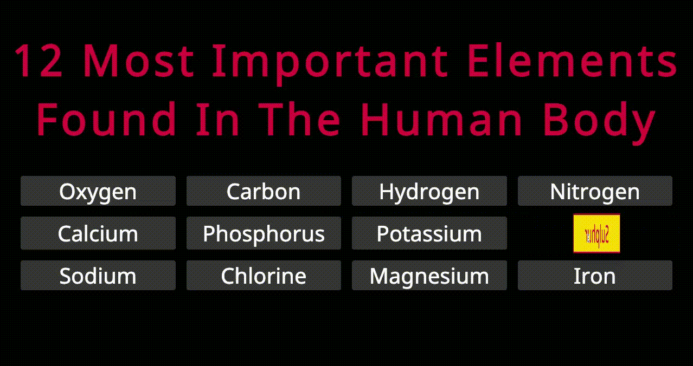

# Basic Grid CSS

- Basic grid using flex to center elements
- display:grid for container
- display: flex for each card

- :hover Psudeo Class using:
- transform()
- transition()
- translate()
- scale()
- rotateY()

